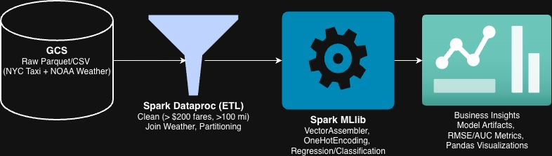

# NYC Yellow Taxi Big Data Analytics — UChicago ADSP 31013 Final Project

<!-- BADGES_BEGIN -->
<p align="center">
  
  
  
  
  
</p>

<p align="center">
  
  
  
  
  
  
  
</p>
<!-- BADGES_END -->

**Course:** ADSP 31013 — Big Data and Cloud Computing (Autumn 2025, University of Chicago)  
**Team:** Group 8 — Zihao Huang, Wangdi Chen, Rui Gong, Jiawei Liu, Chiyang Chen

---

<p align="center">
  
</p>

---

## Project Overview

End-to-end big data analysis of NYC Yellow Taxi trip records, combining weather data enrichment, exploratory analysis, and two supervised ML tasks: fare prediction and tip classification.

| Stage | Description |
|---|---|
| Data & Infrastructure | Fetch NYC taxi trip records; collect weather data via API |
| Data Joining | Join taxi and weather datasets on timestamp and location |
| EDA | Distribution analysis, temporal patterns, feature relationships |
| ML Task 1: Fare Prediction | Regression model to predict trip fare amount |
| ML Task 2: Tip Classification | Binary classifier to predict whether a passenger tips |

---

## Repository Structure

```
notebooks/
  01_fetch_weather.ipynb       Weather data collection pipeline
  02_join_taxi_weather.ipynb   Join taxi and weather datasets
  03_taxi_EDA.ipynb            Exploratory data analysis
  04_taxi_fare_pred.ipynb      Fare prediction model
  05_taxi_tip_pred.ipynb       Tip classification model
  taxi_tip_pred.py             Script version of tip prediction model

rendered/                      Pre-rendered HTML exports of each notebook
images/
  architecture.svg / .jpg      System architecture diagram

slides.pptx                    Final presentation slides
report.pdf                     Project report
```

---

## Business Context

The goal is to leverage historical trip data to reduce information asymmetry between drivers and fleet operators — enabling better route decisions, fare estimation, and tipping behavior insights.

---

## Libraries

```
pyspark · pandas · numpy · matplotlib · seaborn · scikit-learn · requests
```

---

## How to Run

```bash
jupyter notebook notebooks/01_fetch_weather.ipynb
```

Alternatively, open any file in `rendered/` in a browser to view outputs without running code.
